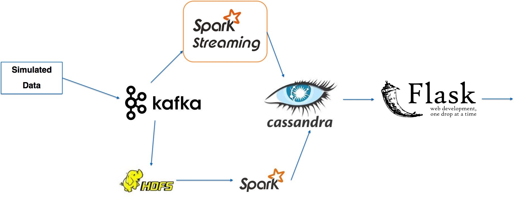
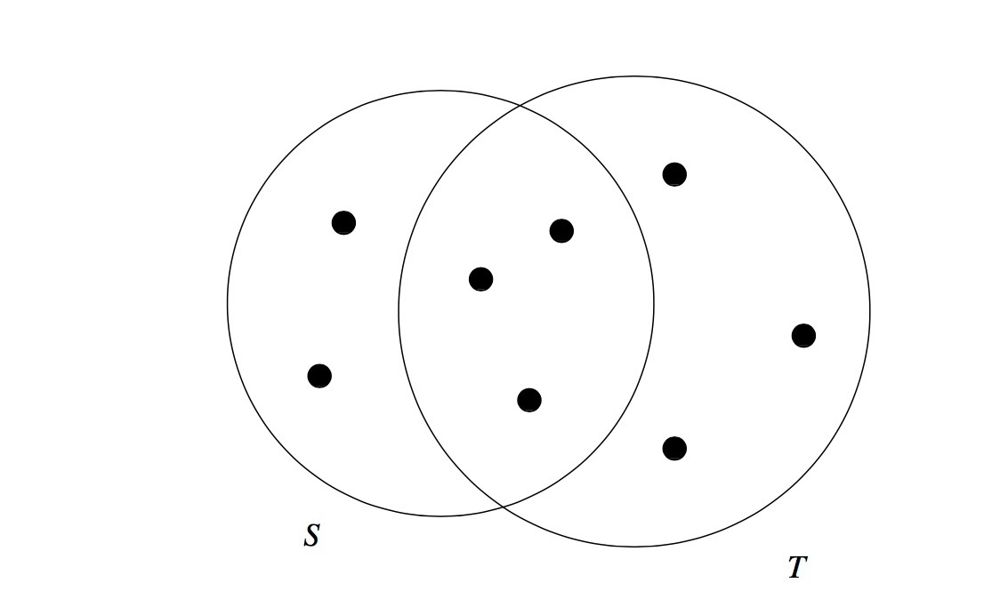
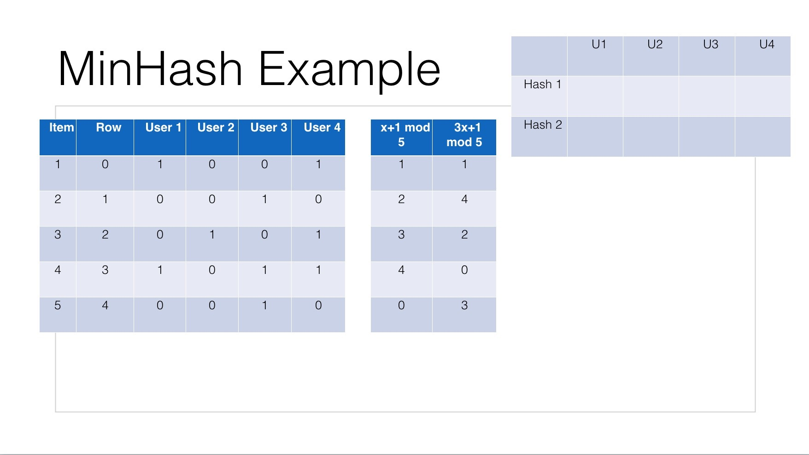
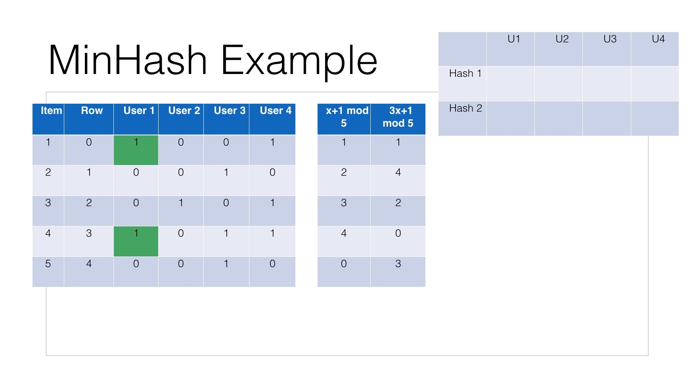
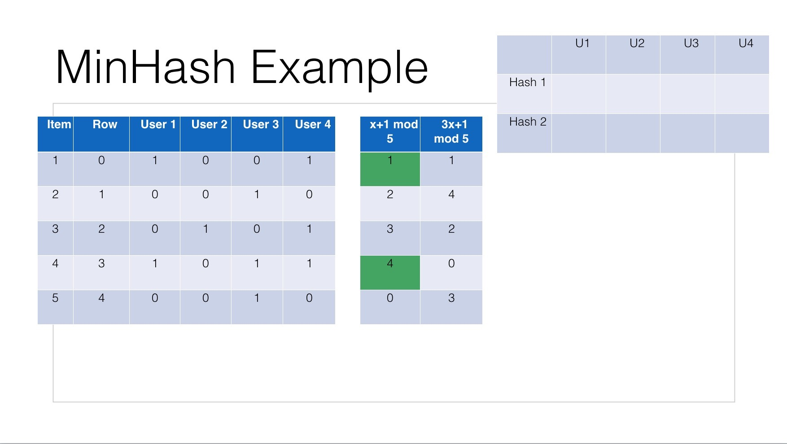
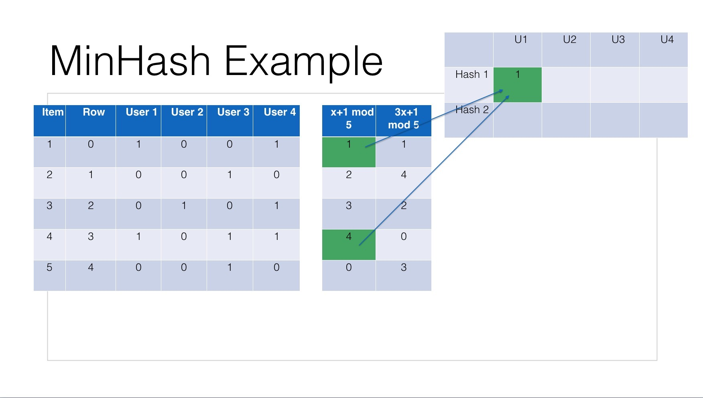

# JustBid bidding system
* Insight Data Engineering Fellow Project

## Pipeline

The pipeline is designed for both batch and real-time processing. The data is generated from EventSim Generator, which is used for simulating people's behavior of listening to music. I changed the format of the data and make it useful for my system. Kafka is used as a queue/broker and Zookeeper is responsible for distributing data in queue to their customers.

## Real-time processing stage
* Streaming

  The first stage is real time streaming with Spark Streaming. I use Scala to access data from Kafka and clean the data, get item_id, user_id, bid_price and also the timestamp from Kafka, with the Cassandra Connector, after processing, data is stored in Cassandra NoSQL Database.
* Database

  Cassandra is used as my database. I need to handle millions of data and need to SELECT bid with the same item_id when I choose item_id as the PRIMARY KEY. Also, I do not need to use JOIN function of different TABLES. Last but not least, timestamp is needed to store and used to sort, so Cassandra is my top choice.
* UI

  Flask is used for data display. The website is live on [sidi.online](http://sidi.online) and [video demo](https://vimeo.com/173849615) is ready on Vimeo.
  
## Batch processing stage
  * Jaccard Similarity 
  
    Jaccard Similarity is widely used for finding similar items or finding similarity between several sets. It is quite simple to understand and quite simple to apply.

    
    
    We can see two sets S and T, the SIM(S,T) = 3/5+6-3 = 3/8.
  
  * MinHash
  
    Though Jaccard Similarity is simple, easy to apply. But when we need to calculate between large amount of sets, each set needs to be calculated with the other sets once to get the most similar set to itself which is quite expensive in time aspect. So MinHash algorithm is implemented in my system to do the batch processing in Spark. This algorithm is introduced in Stanford [CS246](http://web.stanford.edu/class/cs246/) class and the [Mining of Massive Datasets book](http://infolab.stanford.edu/~ullman/mmds/book.pdf).

    Here is an example:
    
    
    
    Assume we have five items and four users and name them starting from 1 respectively. And I give two Hash Function examples, the first Hash Function is x+1 mod 5, the second one is 3x+1 mod 5 which can give me a permutation of numbers between 0 and 4.
    
    
    
    
    Then look at User 1, he bids item 1 and 4 in Row 0 and 3, the corresponding number in Hash function 1 is 1 and 4, 1 and 0 in Hash function 2. Then we need to get the minimum one and update in the new Signature matrix which is shown below.
    
    
    
    
    
    
